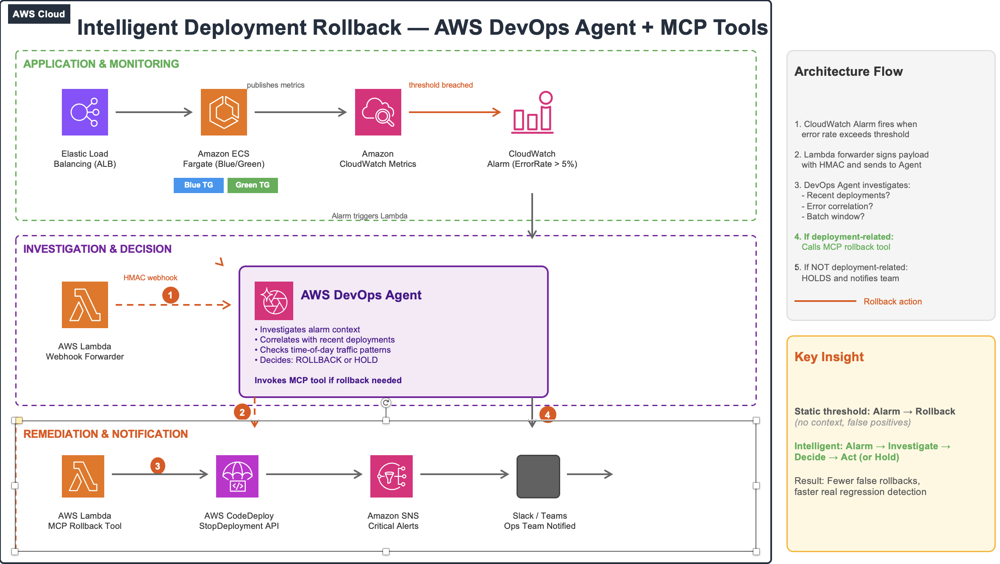

# Intelligent Rollback with AWS DevOps Agent

This sample demonstrates how to build an automated, AI-driven rollback system using **AWS DevOps Agent**, **AWS CodeDeploy**, and a custom **MCP (Model Context Protocol) tool** exposed as an AWS Lambda function.

When a deployment causes elevated error rates or latency, an Amazon CloudWatch alarm triggers the AWS DevOps Agent through a webhook. The agent autonomously decides whether to roll back, using your custom MCP tool to execute the AWS CodeDeploy rollback — all without human intervention.

## Architecture



See [architecture/architecture.md](architecture/architecture.md) for a detailed description.

**Flow:**
1. Sample app deployed through AWS CodeDeploy blue/green to Amazon ECS on AWS Fargate
2. Amazon CloudWatch alarm detects anomalous error rate or latency
3. Alarm invokes the Webhook Forwarder Lambda
4. Webhook Forwarder signs the payload with HMAC-SHA256 and posts the event to the AWS DevOps Agent webhook endpoint
5. AWS DevOps Agent evaluates the situation and invokes the MCP Rollback Tool
6. MCP Rollback Tool calls AWS CodeDeploy `StopDeployment` with auto-rollback enabled
7. Amazon SNS notification sent to operators with action details and audit trail

## Prerequisites

- **AWS Account** with appropriate IAM permissions
- **AWS CLI v2** configured with credentials
- **Docker** installed locally (for building the sample app)
- **AWS DevOps Agent** — available in the AWS Management Console under Amazon Bedrock → DevOps Agent
- **Python 3.12+** for local development and testing
- An **Amazon SNS topic** for operator notifications (created by the deploy script)

## Repository Structure

```
.
├── README.md
├── LICENSE
├── CONTRIBUTING.md
├── .gitignore
├── architecture/
│   └── architecture.md          # Architecture diagram and description
├── mcp-rollback-tool/
│   ├── lambda_function.py       # MCP tool Lambda — rollback, stop, status, list
│   └── requirements.txt
├── webhook-forwarder/
│   ├── lambda_function.py       # CloudWatch alarm → DevOps Agent webhook forwarder
│   └── requirements.txt
├── sample-app/
│   ├── app.py                   # Flask app with configurable failure injection
│   ├── Dockerfile               # Multi-stage production build
│   └── requirements.txt
└── deploy/
    ├── deploy.sh                # Full infrastructure deployment
    ├── cleanup.sh               # Teardown all resources
    ├── taskdef.json             # Amazon ECS task definition template
    ├── appspec.yaml             # AWS CodeDeploy ECS blue/green appspec
    └── buildspec.yml            # AWS CodeBuild buildspec for CI/CD
```

## Deployment

### Quick Start

```bash
# Clone the repository
git clone https://github.com/aws-samples/intelligent-rollback-devops-agent.git
cd intelligent-rollback-devops-agent

# Configure environment variables
export AWS_REGION=us-east-1
export AWS_ACCOUNT_ID=$(aws sts get-caller-identity --query Account --output text)
export DEVOPS_AGENT_WEBHOOK_URL="https://your-devops-agent-webhook-url"
export WEBHOOK_SECRET="your-hmac-secret"
export NOTIFICATION_EMAIL="your-email@example.com"

# Deploy all infrastructure
chmod +x deploy/deploy.sh
./deploy/deploy.sh
```

### Step-by-Step

1. **Build and push the sample app** to Amazon ECR
2. **Deploy the Amazon ECS service** with AWS CodeDeploy blue/green
3. **Deploy the MCP Rollback Tool Lambda** and register with the AWS DevOps Agent
4. **Deploy the Webhook Forwarder Lambda** with Amazon CloudWatch alarm trigger
5. **Configure the AWS DevOps Agent** with the MCP tool endpoint and webhook

See [deploy/deploy.sh](deploy/deploy.sh) for complete commands.

## Usage

### Triggering a Rollback (Demo)

Inject failures into the running sample app by updating the Amazon ECS task definition environment variables:

```bash
# Deploy a "bad" version with 50% error rate
aws ecs update-service \
  --cluster intelligent-rollback-cluster \
  --service sample-app-service \
  --task-definition sample-app-bad

# The Amazon CloudWatch alarm will fire within 1-2 minutes,
# triggering the AWS DevOps Agent to evaluate and roll back
```

### Manual MCP Tool Invocation (Testing)

```bash
# Check deployment status
aws lambda invoke \
  --function-name mcp-rollback-tool \
  --payload '{"action": "status", "deployment_group": "sample-app-dg"}' \
  response.json

# List recent deployments
aws lambda invoke \
  --function-name mcp-rollback-tool \
  --payload '{"action": "list", "application_name": "sample-app"}' \
  response.json
```

## Configuration

| Environment Variable | Description | Default |
|---------------------|-------------|---------|
| `AWS_REGION` | AWS Region for deployment | `us-east-1` |
| `CODEDEPLOY_APP_NAME` | AWS CodeDeploy application name | `sample-app` |
| `CODEDEPLOY_DG_NAME` | AWS CodeDeploy deployment group name | `sample-app-dg` |
| `SNS_TOPIC_ARN` | Amazon SNS topic for notifications | (required) |
| `WEBHOOK_URL` | AWS DevOps Agent webhook endpoint | (required) |
| `WEBHOOK_SECRET` | HMAC secret for webhook signing | (required) |
| `ERROR_RATE` | Sample app error rate (0.0-1.0) | `0.0` |
| `LATENCY_MS` | Sample app added latency (ms) | `0` |

## Cleanup

```bash
chmod +x deploy/cleanup.sh
./deploy/cleanup.sh
```

## Security

### Production Hardening Notes

This is a demonstration sample. Before using it as a basis for production, note:

- **TLS termination:** The Application Load Balancer serves plain HTTP on port 80
  for demo simplicity. Production deployments should add an HTTPS listener with an
  AWS Certificate Manager (ACM) certificate and terminate TLS at the ALB.
- **Least-privilege IAM:** AWS CodeDeploy actions (`StopDeployment`, `GetDeployment`,
  `BatchGetDeployments`, `ListDeployments`) are scoped to this sample's application
  and deployment group ARNs. `cloudwatch:PutMetricData` does not support
  resource-level permissions and is constrained by a `cloudwatch:namespace` condition.
- **Webhook authentication:** Webhook payloads are signed with HMAC-SHA256 using a
  shared secret (`WEBHOOK_SECRET`). For production, store the secret in AWS Secrets
  Manager rather than plain environment variables and rotate it regularly.
- **Amazon SNS notifications:** Both the MCP Rollback Tool and the Webhook Forwarder
  publish operator notifications to Amazon SNS after each action, providing an audit
  trail for the operations team.

To report a security issue, see [SECURITY.md](SECURITY.md). See
[CONTRIBUTING](CONTRIBUTING.md#security-issue-notifications) for more information.

## License

This library is licensed under the Apache-2.0 License. See the [LICENSE](LICENSE) file.
